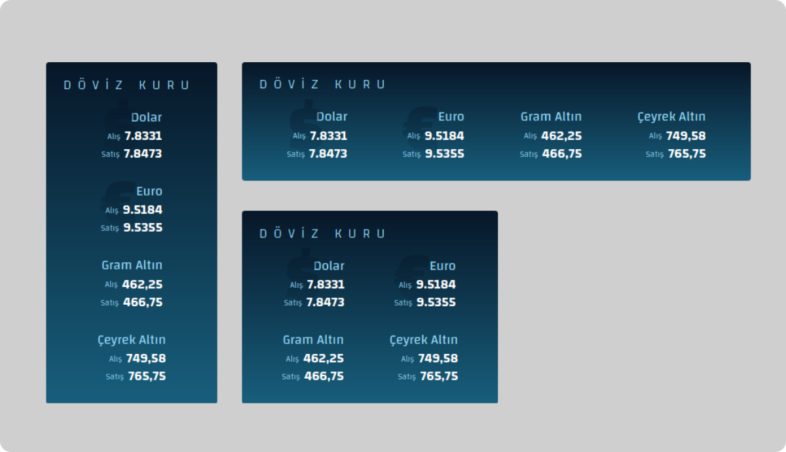

# KOD8 Web Componenets
---
# __Puan Durumu__
Sayfanın `head` bölümüne komponenti aşağıdaki gibi ekleyin.

```html
    <script defer src="https://raw.githubusercontent.com/kod8/kod8-web-componenets/main/puanDurumu.js"></script>
```

## Örnek Kullanımlar
Kapsayıcısının genişliğini alır. 

```html 
<puan-durumu lig="superLig"></puan-durumu>
```

```html 
<puan-durumu lig="superLig" hl="Yeni Malatya" theme="t1"></puan-durumu>
```

```html 
<puan-durumu 
	lig="superLig" 
	hl="Yeni Malatya" 
	theme="t1" 
	style="--cell-pad:12px; font-size:24px; font-family:arial; --darker:#6F81DE; --dark:#0D1B61; --main:#F5F7FF; --light:#2E334A; --lighter:#27282E;">

</puan-durumu>
```

## Attributes
- **`lig`**:(zorunlu) Puan durumunun gösterileceği ligin kısa adı
	- `superLig`: Süper Lig
	- `l1`: 1. Lig	
	- `l2k`: 2. Lig Kırmızı Grup
	- `l2b`: 2. Lig Beyaz Grup
	- `l3g1`: 3 Lig 1. Grup
	- `l3g2`: 3 Lig 2. Grup
	- `l3g3`: 3 Lig 3. Grup
	- `l3g4`: 3 Lig 4. Grup	
	
- **`hl`**: Highlight: Seçili olması gereken takımın tablodaki tam adı.
- **`theme`**: Tema (6 farklı tema seçeneği) `t1` `t2` `t3` `t4` `t5`


- **`style`** : Temadaki bazı değişkenleri değiştirmek için kullanılabilir.
	- Renk değişkenleri: 6 ton (Ana, Açık, Daha açık, Koyu, Daha koyu) `--main` `--light` , `--lighter`, `--dark` , `--darker`
	- Hücre üst boşluğu: `--cell-pad`;
	- Diğer CSS değerleri: `font-size` , `font-family`

---

# __Döviz Kuru__ 
Sayfanın `head` bölümüne komponenti aşağıdaki gibi ekleyin. 

```html
    <script defer src="https://raw.githubusercontent.com/kod8/kod8-web-componenets/main/dovizKuru.js"></script>
```
## Örnek Kullanım
Kapsayıcısının genişliğini alır. 

```html
<doviz-kuru></doviz-kuru>
```




---